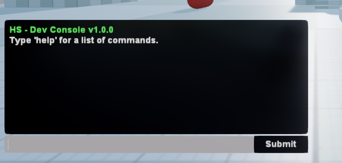

A in-game command-line interface for Stride Engine that enables custom commands, automated scripting, debugging workflows, and rapid development iteration.

## 🎯 Overview

HS Dev Console transforms your game into a controllable, scriptable environment. Execute commands, run automated test sequences, spawn entities, modify game state, and debug issues without stopping gameplay or rebuilding.



### Design Philosophy

**Custom command registration**, ensuring updates don't break your workflows.

### Command Ecosystem Architecture
1. **Base System:** Command parsing, execution, history, auto-completion
2. **Predefined Commands:** Essential utilities (help, clear, echo, version, script execution)
3. **Custom Commands:** Your game-specific functionality (spawning, debugging, testing)
4. **Script System:** Automated command sequences with timing control
5. **Flag System:** Command variants and advanced parameter handling

**Optimal Workflow:** Build Commands → Test Live → Script Sequences → Automate Testing

## 🚀 Installation

### Prerequisites
1. Stride Engine 4.2.0.2381 or newer
2. **Happenstance Stride Engine Core** (required - install first)

### Quick Setup
1. **Install Dependencies:** Download and install [Happenstance Stride Engine Core](https://github.com/Keepsie/HS-Stride-Engine-Core) first (*REQUIRED*)
2. **Copy Code:** Add DevConsole scripts to `Code/Happenstance/DevConsole/`  
3. **Copy Assets:** Add DevConsole assets to `Assets/Happenstance/DevConsole/`
4. **Scene Setup:** Drag the ConsoleManager prefab into your scene
5. **Test:** Press `` ` `` (backtick) to open console, type `help`

### ⚠️ IMPORTANT: Input Integration

**To avoid conflicting inputs, integrate these bools into your input systems:**

```csharp
// Get references to the dev tools
var devEditorManager = EntityFinder.FindAllComponents<DevEditorManager>().FirstOrDefault();
var devCamera = EntityFinder.FindAllComponents<DevCamera>().FirstOrDefault();

// Check before processing your input
if (!devEditorManager?.DevEditorActive && !devCamera?.DevCameraActive)
{
    // Safe to process your game input
    HandlePlayerInput();
    HandleGameplayInput();
}

// Specific keys to avoid when dev tools are active:
// F10, F11 - Tool toggles
// Arrow Keys, R, S - When DevEditorActive is true
// Ctrl+Z, Ctrl+Y - When DevEditorActive is true
// WASD, Mouse, E, Q - When DevCameraActive is true
```

### ⚠️ IMPORTANT: Debug Build Only

**The console automatically disables in release builds:**
```csharp
#if DEBUG
    IsDebugBuild = true; //I Might make this more rebust and delete entity later
#endif
```

This ensures no console overhead or security issues in shipped games.

## 🎮 Usage Guide

### Basic Workflow

1. **Open Console**
   - Press `` ` `` (backtick key) to toggle console
   - Console appears with welcome message and version info

2. **Command Execution**
   - Type commands and press Enter
   - Use `Tab` for auto-completion
   - Use `Up/Down` arrows for command history

3. **Get Help**
   - `help` - Lists all available commands
   - `[command] -h` - Help for specific command
   - `help -c [command]` - Detailed command description

### Essential Commands

```bash
help                    # List all commands
clear                   # Clear console
echo Hello World        # Print text
version                 # Show console version
execute_script test.txt # Run command script
exit                    # Close application
```

## ✨ Core Features

### 🎯 Advanced Command System
Flexible command registration with flag support and parameter handling.

**Basic Commands:**
```csharp
// Register a simple command
consoleManager.RegisterConsoleCommand(
    new ConsoleCommand("spawn", "Spawns an entity", "", SpawnCommand)
);

void SpawnCommand(string[] args)
{
    string entityType = args.Length > 0 ? args[0] : "default";
    // Your spawning logic
    console.WriteToConsole($"Spawned {entityType}");
}
```

**Flag-Based Command Variants:**
```csharp
// Multiple command variants with flags
consoleManager.RegisterConsoleCommand(
    new ConsoleCommand("spawn", "Spawn entity at position", "-pos", SpawnAtPosition)
);
consoleManager.RegisterConsoleCommand(
    new ConsoleCommand("spawn", "Spawn with rotation", "-rot", SpawnWithRotation)
);

// Usage: spawn -pos 10 20 30
// Usage: spawn -rot 0 90 0
```

### 📜 Powerful Script System
Execute automated command sequences with precise timing control.

**Script Features:**
- **Comments:** `// This is a comment`
- **Timing Control:** `pause(5.0)` - Wait 5 seconds
- **Command Sequences:** Any registered command
- **Nested Scripts:** Scripts can call other scripts
- **Error Handling:** Continues execution on non-critical errors

**Example Script (`test_sequence.txt`):**
```bash
// Automated test sequence
clear
echo Starting automated test...

// Spawn test entities
spawn player
pause(1.0)
spawn -pos 10 0 0 enemy
spawn -pos -10 0 0 enemy

// Wait and check results
pause(3.0)
echo Test entities spawned
list_entities

// Cleanup
pause(2.0)
clear_all_enemies
echo Test completed
```

**Execute Script:**
```bash
execute_script test_sequence.txt  (Must be full path to file C:// whatever)

```

### 🔄 Command History & Auto-Completion
Efficient command usage.

**Command History:**
- Stores last 100 commands (configurable)
- Navigate with `Up/Down` arrow keys
- Duplicates automatically removed
- Persists during session

**Auto-Completion:**
- Press `Tab` to complete partial commands
- Shows multiple matches when ambiguous
- Updates automatically when new commands registered

### 🎨 Rich Message System
Color-coded output for different message types.

**Message Types:**
```csharp
console.WriteToConsole("Normal message");
console.WriteToConsole("Error occurred!", MessageType.Error);      // Red
console.WriteToConsole("Success!", MessageType.Success);           // Green  
console.WriteToConsole("Warning", MessageType.Warning);            // Yellow
console.WriteToConsole("Info", MessageType.Information);           // Blue
```

## 🛠️ Creating Custom Commands

### Basic Custom Command

```csharp
public class GameCommands : HSSyncScript
{
    private ConsoleManager _console;
    
    public override void OnStart()
    {
        _console = EntityFinder.FindAllComponents<ConsoleManager>().FirstOrDefault();
        RegisterGameCommands();
    }
    
    private void RegisterGameCommands()
    {
        // Basic command
        _console.RegisterConsoleCommand(
            new ConsoleCommand("health", "Set player health", "", SetHealthCommand)
        );
        
        // Command with help flag
        _console.RegisterConsoleCommand(
            new ConsoleCommand("health", "Show health command help", "-h", 
                args => ShowCommandHelp("health"))
        );
    }
    
    private void SetHealthCommand(string[] args)
    {
        if (args.Length == 0)
        {
            _console.WriteToConsole("Current health: 100", MessageType.Information);
            return;
        }
        
        if (float.TryParse(args[0], out float health))
        {
            // Set player health logic here
            _console.WriteToConsole($"Health set to {health}", MessageType.Success);
        }
        else
        {
            _console.WriteToConsole("Usage: health [amount]", MessageType.Error);
        }
    }
}
```

### Advanced Command with Flags

```csharp
private void RegisterAdvancedCommands()
{
    // Teleport command variants
    _console.RegisterConsoleCommand(
        new ConsoleCommand("teleport", "Teleport to coordinates", "-pos", TeleportToPosition)
    );
    _console.RegisterConsoleCommand(
        new ConsoleCommand("teleport", "Teleport to named location", "-loc", TeleportToLocation)
    );
    _console.RegisterConsoleCommand(
        new ConsoleCommand("teleport", "Teleport to another player", "-player", TeleportToPlayer)
    );
}

private void TeleportToPosition(string[] args)
{
    if (args.Length < 3)
    {
        _console.WriteToConsole("Usage: teleport -pos <x> <y> <z>", MessageType.Error);
        return;
    }
    
    if (float.TryParse(args[0], out float x) && 
        float.TryParse(args[1], out float y) && 
        float.TryParse(args[2], out float z))
    {
        // Teleport logic
        _console.WriteToConsole($"Teleported to ({x}, {y}, {z})", MessageType.Success);
    }
}

// Usage: teleport -pos 10 5 20
// Usage: teleport -loc spawn_point
// Usage: teleport -player John
```

### Command Categories Pattern

```csharp
public class DebugCommands : HSSyncScript
{
    public override void OnStart()
    {
        var console = EntityFinder.FindAllComponents<ConsoleManager>().FirstOrDefault();
        RegisterDebugCommands(console);
    }
    
    private void RegisterDebugCommands(ConsoleManager console)
    {
        // Debug category
        console.RegisterConsoleCommand(new ConsoleCommand("debug_draw", "Toggle debug drawing", "", ToggleDebugDraw));
        console.RegisterConsoleCommand(new ConsoleCommand("debug_info", "Show debug info", "", ShowDebugInfo));
        console.RegisterConsoleCommand(new ConsoleCommand("debug_perf", "Performance metrics", "", ShowPerformance));
        
        // Game state category  
        console.RegisterConsoleCommand(new ConsoleCommand("game_pause", "Pause game", "", PauseGame));
        console.RegisterConsoleCommand(new ConsoleCommand("game_speed", "Set game speed", "", SetGameSpeed));
        console.RegisterConsoleCommand(new ConsoleCommand("game_reset", "Reset level", "", ResetLevel));
    }
}
```

## 🔧 Advanced Scripting

### Complex Test Scripts

**Entity Stress Test (`stress_test.txt`):**
```bash
// Stress test script
clear
echo === Entity Stress Test ===

// Spawn wave 1
echo Spawning wave 1...
spawn_enemies 10
pause(2.0)

// Spawn wave 2  
echo Spawning wave 2...
spawn_enemies 20
pause(3.0)

// Performance check
show_performance
pause(1.0)

// Cleanup
echo Cleaning up...
clear_all_enemies
pause(1.0)

echo Stress test completed
show_performance
```

**Level Testing Sequence (`level_test.txt`):**
```bash
// Complete level test
clear
echo === Level Testing Sequence ===

// Setup
debug_draw true
god_mode true

// Test spawn points
echo Testing spawn points...
teleport -loc spawn_1
pause(1.0)
teleport -loc spawn_2  
pause(1.0)
teleport -loc spawn_3
pause(1.0)

// Test enemy AI
echo Testing enemy AI...
spawn_enemies 5
ai_debug true
pause(5.0)

// Test pickup systems
echo Testing pickups...
spawn_pickups health 3
spawn_pickups ammo 5
pause(2.0)

// Cleanup and report
clear_all
debug_draw false
god_mode false
echo Level test completed successfully
```

### Script Best Practices

**1. Always include error handling:**
```bash
// Check if player exists before commands
echo Checking player state...
player_exists
// (Your custom command that verifies player)
pause(0.5)
```

**2. Use meaningful pauses:**
```bash
spawn_enemy
pause(1.0)    // Wait for spawn animation
test_ai       // AI won't be ready immediately
```

**3. Provide user feedback:**
```bash
echo Starting complex operation...
heavy_computation_command
echo Operation completed
```

## ⚠️ Important Notes

### Custom Command Guidelines

- ✅ Create your own command classes
- ✅ Use flag variants for different functionality
- ✅ Provide help commands for all custom commands
- ✅ Handle invalid input gracefully
- ✅ Use appropriate message types for output


### Performance Considerations

- Console is disabled in release builds automatically
- Command execution is synchronous - avoid long-running operations
- Script execution includes small delays between commands
- History system automatically manages memory usage
- UI updates only when console is visible

### Security Notes

- **Debug builds only** - automatically disabled in release
- **No file system write access** through default commands
- **Script execution** reads files but doesn't execute arbitrary code (Must be the full path to file).
The file does not need to be .txt it could be anything .cs so on. I use .cs for better code highlighting when making commands.
- **Custom commands** should validate all input parameters

## 🔧 Integration Examples

### Game Manager Integration

```csharp
public class GameManagerCommands : HSSyncScript
{
    private GameManager _gameManager;
    private ConsoleManager _console;
    
    public override void OnStart()
    {
        _gameManager = EntityFinder.FindAllComponents<GameManager>().FirstOrDefault();
        _console = EntityFinder.FindAllComponents<ConsoleManager>().FirstOrDefault();
        
        RegisterGameManagementCommands();
    }
    
    private void RegisterGameManagementCommands()
    {
        _console.RegisterConsoleCommand(
            new ConsoleCommand("level", "Load specific level", "", LoadLevelCommand)
        );
        _console.RegisterConsoleCommand(
            new ConsoleCommand("save", "Save game state", "", SaveGameCommand)
        );
        _console.RegisterConsoleCommand(
            new ConsoleCommand("load", "Load game state", "", LoadGameCommand)
        );
    }
    
    private void LoadLevelCommand(string[] args)
    {
        if (args.Length == 0)
        {
            _console.WriteToConsole($"Current level: {_gameManager.CurrentLevel}");
            return;
        }
        
        string levelName = args[0];
        if (_gameManager.LoadLevel(levelName))
        {
            _console.WriteToConsole($"Loaded level: {levelName}", MessageType.Success);
        }
        else
        {
            _console.WriteToConsole($"Failed to load level: {levelName}", MessageType.Error);
        }
    }
}
```

### Entity Spawning System

```csharp
public class SpawnCommands : HSSyncScript
{
    private SpawnManager _spawnManager;
    
    private void RegisterSpawnCommands()
    {
        var console = EntityFinder.FindAllComponents<ConsoleManager>().FirstOrDefault();
        
        // Basic spawn
        console.RegisterConsoleCommand(
            new ConsoleCommand("spawn", "Spawn entity", "", SpawnEntityCommand)
        );
        
        // Spawn at position
        console.RegisterConsoleCommand(
            new ConsoleCommand("spawn", "Spawn at position", "-at", SpawnAtPositionCommand)
        );
        
        // Spawn multiple
        console.RegisterConsoleCommand(
            new ConsoleCommand("spawn", "Spawn multiple entities", "-count", SpawnMultipleCommand)
        );
        
        // List spawnable entities
        console.RegisterConsoleCommand(
            new ConsoleCommand("spawn_list", "List spawnable entities", "", ListSpawnablesCommand)
        );
    }
}
```

## 🤝 Contributing

Create your own command extensions and share them! The modular design makes it easy to package and distribute command sets.

By submitting a pull request, you agree to license your contribution under the MIT License.

## 📄 License

MIT License - see LICENSE.txt for full text.

**HS Dev Console for Stride**  
Copyright © 2025 Happenstance Games LLC
